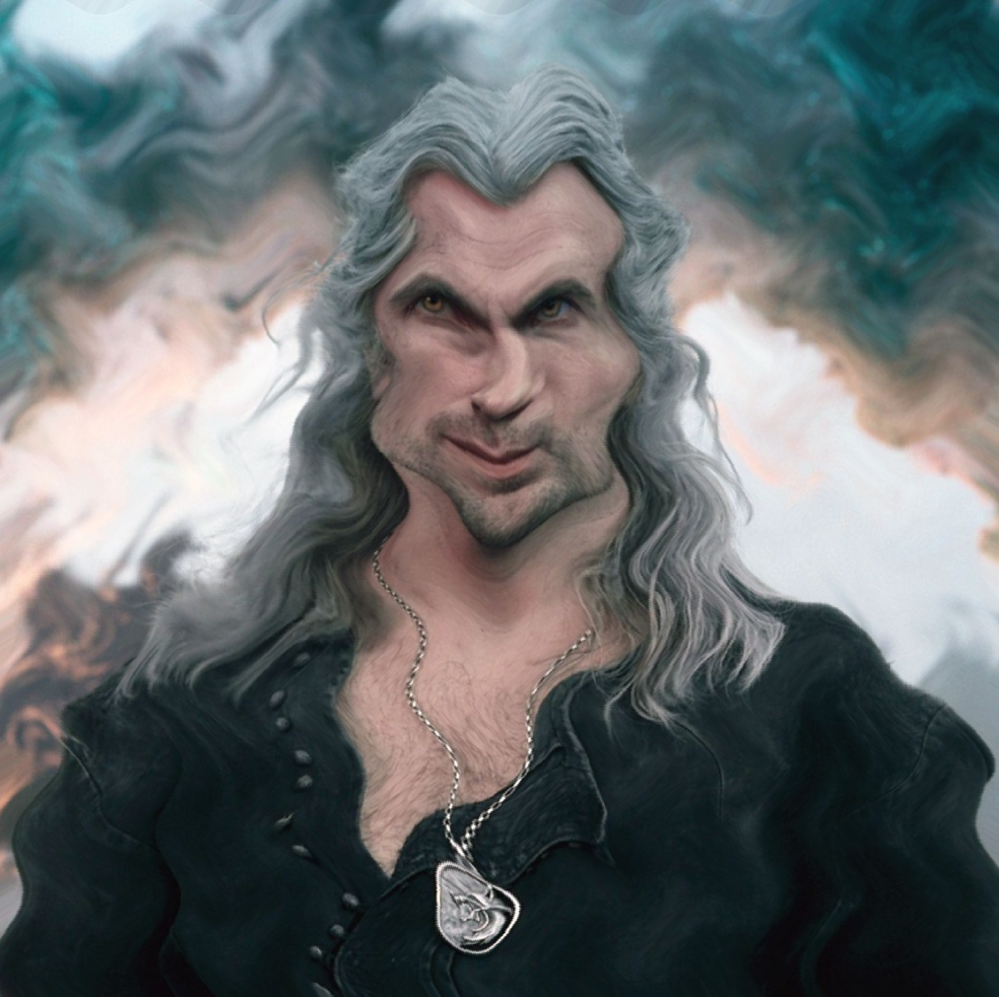

# Wave-Effect-in-Images-using-OpenCV
Applying wave effects to images using OpenCV. This script demonstrates how to apply horizontal, vertical, or both horizontal and vertical wave effects to images. It utilizes mathematical functions to create wave-like distortions in the image.

## Dependencies

- Python 3.x
- OpenCV (cv2)
- NumPy

## Functionality
The script provides the following functionalities:

 - Horizontal Wave Effect: Applies a horizontal wave distortion to the image.
 - Vertical Wave Effect: Applies a vertical wave distortion to the image.
 - Horizontal and Vertical Wave Effect: Simultaneously applies both horizontal and vertical wave distortions to the image.
## Results

Below are the results of applying wave effects to images:

| **Horizontal Wave Effect** | **Vertical Wave Effect** | **Horizontal and Vertical Wave Effect** |
|:--------------------------:|:------------------------:|:---------------------------------------:|
|  |  |  |

These images demonstrate the distortions created by applying horizontal, vertical, or both horizontal and vertical wave effects using the provided script.

You can find the script and images in the GitHub repository [here](link_to_repository).
